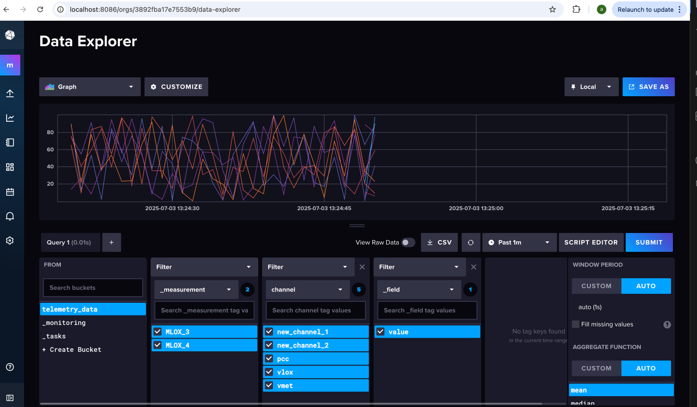

# Telemetry_systems

**TelemetryDB** is a lightweight Python package designed to manage telemetry time-series data using **InfluxDB 1.x**. It is ideal for use with test stands, simulations, or live systems. Data is organized into **Assets**, each containing multiple **Channels**, where each channel is a series of timestamped floating-point values.

---

## 📦 Features

- 🚀 Define telemetry **Assets** with multiple **Channels**
- ⏱️ Store and retrieve `(timestamp, value)` time-series data
- 🗃️ Supports writing and querying using **InfluxDB 1.x**
- 🧪 Mock/test data scripts included
- 🔁 Easy to extend, test, and integrate into larger systems

---

## 🚀 Quickstart

### ✅ Prerequisites

- Python **3.10+**
- **Docker** (to run InfluxDB locally)
- **pip** (for Python package management)

---

### 🔧 Setup

#### 1. Start InfluxDB Locally

In the project root directory (`telemetry_systems`), run:

```bash
docker-compose up -d
```
This spins up a local InfluxDB 1.48 instance on http://localhost:8086 using the included docker-compose.yml


#### 2. Install Python Dependencies
Install all required Python packages by running:

```bash
pip install -r requirements.txt
```

#### 3. Populate, Query, and Test the Data

Run the data population and retrieval script from root directory by executing:

```bash
python3 -m scripts.data_population_retreieval
```

##### What the script does:

- Adds 2 assets

- Each asset contains 3 channels

- Each channel has 60 samples (collected at 1Hz for 1 minute)

- Queries asset data

- Filters data by time range or channel

- Prints the query results to the console

## Note: if you get an error, make sure you have a .env file, or create one based on .env.example.

### 🧪 View Data in InfluxDB UI

You can also inspect the data at the UI level by visiting:

[http://localhost:8086](http://localhost:8086)

- **Username:** `user`  
- **Password:** `userpass`

Once logged in, you should see something like this:



## 📜 License

This project is licensed under the Apache License 2.0. See the [LICENSE](LICENSE) file for details.
